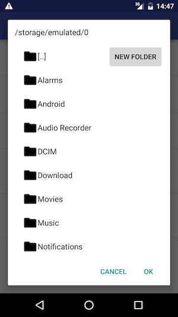
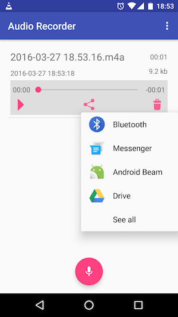
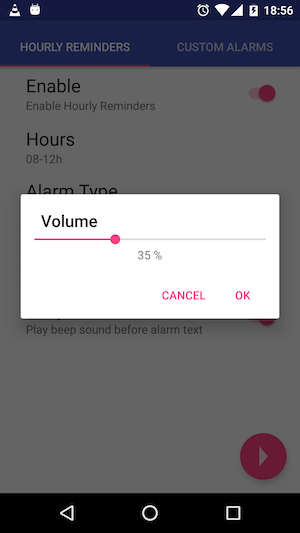
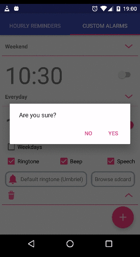
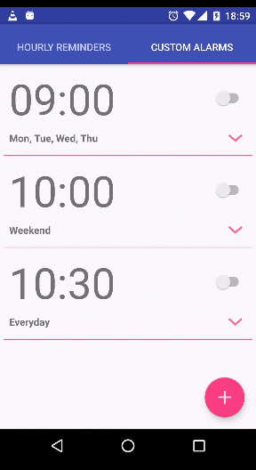

# android-library

Android Widgets and Support Class Library

# Class List

* [OpenFileDialog.java](./src/main/java/com/github/axet/androidlibrary/widgets/OpenFileDialog.java)

Android Directory / File Choicer Dialog with options to create / rename / delete file. Can be used as standalone java file.



* [PopupShareActionProvider.java](./src/main/java/com/github/axet/androidlibrary/widgets/PopupShareActionProvider.java)



* [SeekBarPreference.java](./src/main/java/com/github/axet/androidlibrary/widgets/SeekBarPreference.java)



Expandable List View

* [RemoveItemAnimation.java](./src/main/java/com/github/axet/androidlibrary/animations/RemoveItemAnimation.java)



* [MarginAnimation.java](./src/main/java/com/github/axet/androidlibrary/animations/MarginAnimation.java)



WebViewCustom

* [WebViewCustom.java](./src/main/java/com/github/axet/androidlibrary/widgets/WebViewCustom.java)

Support Apache HttpClient, Proxying...

# Install

## gradle

```gradle
    compile 'com.github.axet:android-library:1.2.12'
```

## maven

```xml
<dependency>
  <groupId>com.github.axet</groupId>
  <artifactId>android-library</artifactId>
  <version>1.2.12</version>
  <type>aar</type>
</dependency>
```
